# Печка

В сарае холодно. Растопи печь — и станет тепло. Это вся завязка: никаких
меню, деревьев умений и туториалов на сорок минут. Заходишь, тебе говорят
«подойди к печке», через минуту у тебя горит огонь, через десять в сарае
+20 и за окном валит снег.

А если закрыть заслонку на раскалённой печи, труба уходит в небо вместе с
крышей.

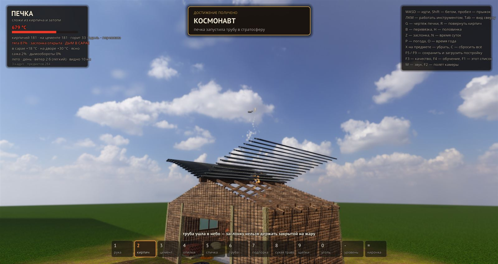

Игра на Godot 4 (Forward+, Vulkan). Всё вокруг — настоящая физика: каждый
кирпич, щепка, уголёк, ведро и чайник — отдельное тело, которое можно
взять, бросить и уронить себе на ногу.

## Что тут можно делать

**Топить.** Набросал травы, чиркнул спичкой, подкинул щепок — и смотришь,
как печь краснеет изнутри. Семь видов топлива, у каждого своя температура,
своё пламя и свой дым. Уголь даёт тысячу градусов.

**Сломать.** Закрытая заслонка на жару — и печка отправляет трубу в
стратосферу. Пошвырять уголь в топке — поднимется угольная пыль, а она
взрывается. Забыть про сажу — труба вспыхнет факелом. Догреть до 1000 °C —
загорится весь сарай.

**Построить.** Снёс всё клавишей C — и складываешь свою печь с нуля: с
перевязкой, на цементе, со сводом над топкой и трубой наружу. Собрал криво —
кладка треснет от жара и осядет.

**Жить.** Поставить чайник, сварить в чугунке, принести воды из бочки,
пересидеть грозу, посмотреть на млечный путь, замёрзнуть под дождём и
отогреться у печки.

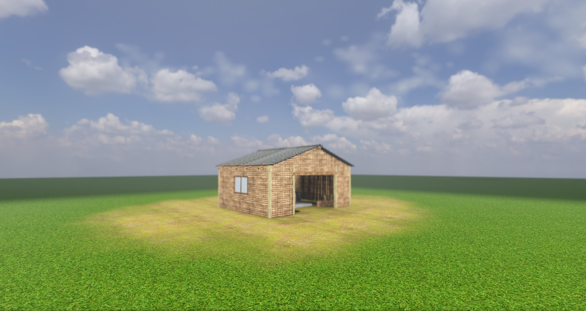

## С чего начать

Ни во что вникать не надо — игра проведёт сама. Слева висит один шаг за
раз: что сделать, какой клавишей и зачем. Шаг закрывается сам, как только
дело сделано, и над нужным местом светится колечко. Семь шагов, десять
минут, и ты умеешь топить печь.

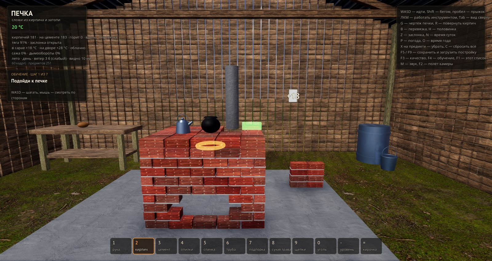
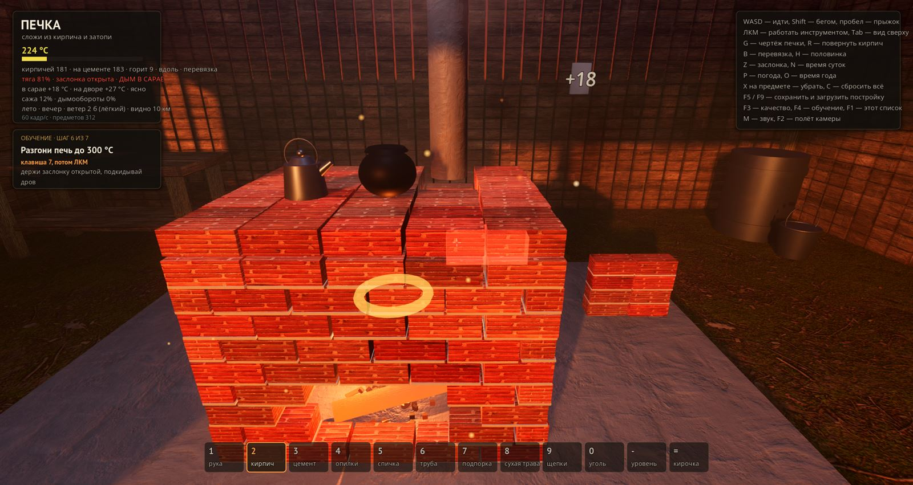

Кто хочет складывать печь сам — жмёт **G**, и в воздухе проступает чертёж:
синие призраки показывают, куда кладётся текущий ряд. Кирпичи всё равно
надо принести, повернуть и промазать цементом — но теперь видно, куда
именно. В строке состояния — «сложено 78 из 173».

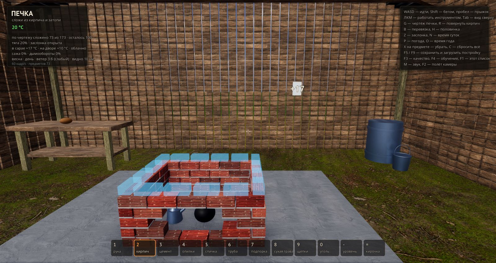

Обучение выключается на **F4**, полный список клавиш висит справа и прячется
на **F1**.

| Клавиша | Что делает |
| --- | --- |
| WASD, Shift, пробел | идти, бегом, прыжок |
| ЛКМ | работать инструментом |
| 1…= | выбрать инструмент |
| G | чертёж печки |
| R, B, H | повернуть кирпич, перевязка, половинка |
| Z | заслонка |
| N, O, P | время суток, время года, погода |
| Tab, F2 | вид сверху, полёт камеры |
| F3, F4 | качество картинки, обучение |
| F5, F9 | сохранить и загрузить постройку |
| X, C | убрать предмет, сбросить всё |

## Печка-ракета

Заслонка перекрывает выход дыму. На тёплой печи это нормально — так держат
жар. На раскалённой газам и пару деться некуда, и давление растёт: в строке
состояния загорается «ДАВЛЕНИЕ», из-под заслонки лезет свист, всё выше и
выше. Кто не понял намёка — получает трубу в небе, сорванную крышу,
замедление времени на полторы секунды и достижение КОСМОНАВТ.

Через семь секунд крыша встаёт на место, и можно повторить.

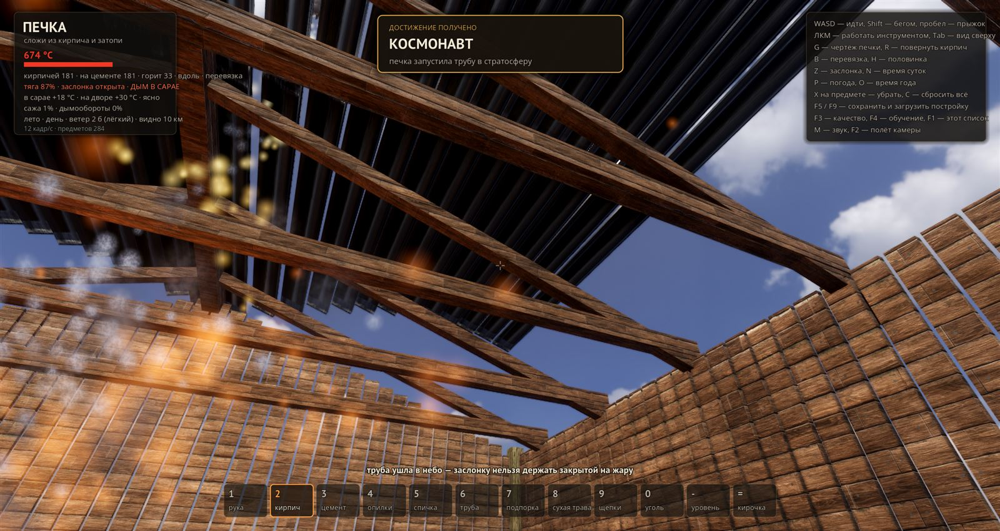

## Погода

Погода — отдельная система на 1300 строк: сезон, время суток, тип погоды,
ветер по Бофорту, облака, осадки, гроза, туман, радуга и лужи считаются в
одном месте, чтобы свет, небо и земля не спорили друг с другом.

### Небо

Пять ярусов облаков — кучевые, перистые, слоистые, кучево-дождевые и грозовые
наковальни. Каждое облако набрано из двух десятков пуховок разного калибра,
поэтому край рваный, а середина плотная. Облака едут по ветру и красятся под
время суток: белые днём, розовые на закате, почти чёрные в грозу.

Ночью — панорама с одиннадцатью тысячами звёзд, млечным путём поперёк неба и
Полярной на севере. Луна с четырьмя фазами, и чем она полнее, тем светлее
двор. Звёзды мерцают.

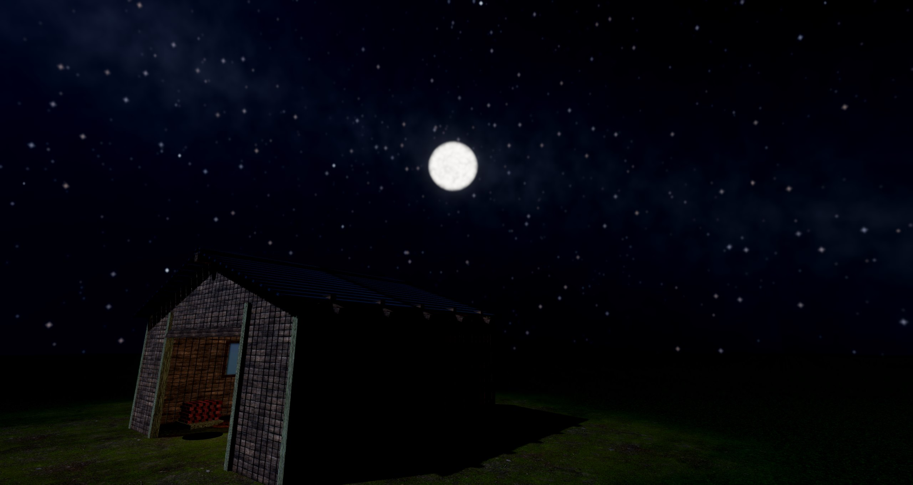
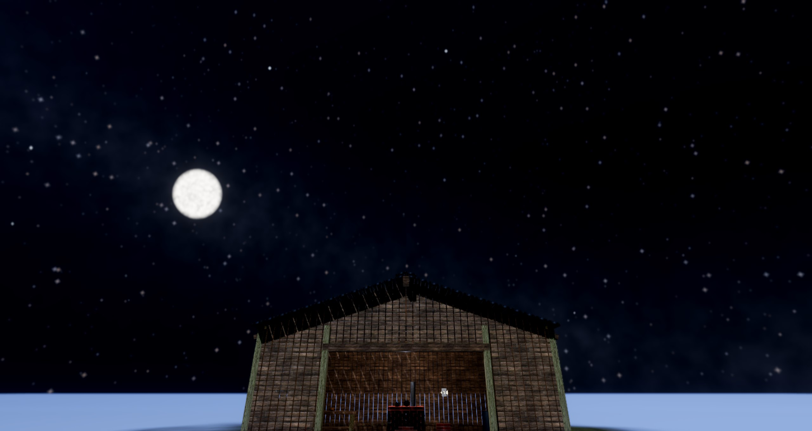

Рассвет и закат считаются по-своему: у горизонта тёплое рассеивание, вверху
глубокая синь, солнце идёт по дуге и меняет цвет с апельсинового на белый и
обратно на красный.

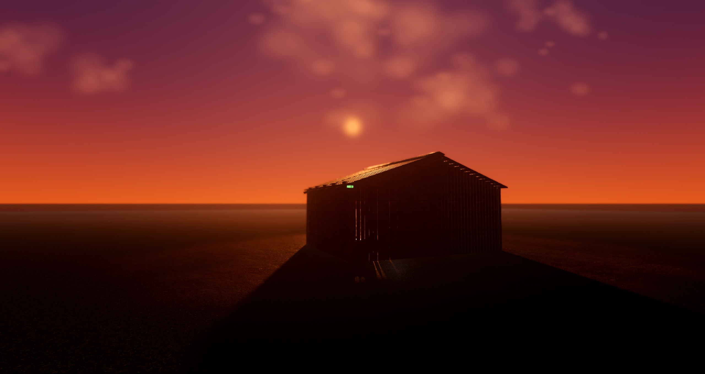

### Осадки

Тринадцать видов погоды: ясно, облачно, морось, дождь, ливень, гроза, грибной
дождь, снег, метель, пурга, град, ледяной дождь и туман. Капли тонкие и их
двенадцать тысяч; в ливень они идут струями и разбиваются о землю брызгами.
Снег — от пушинки до мокрого хлопка, в метель летит почти горизонтально.
Град — четырёхсантиметровый лёд, который скачет по двору и стучит по крыше.

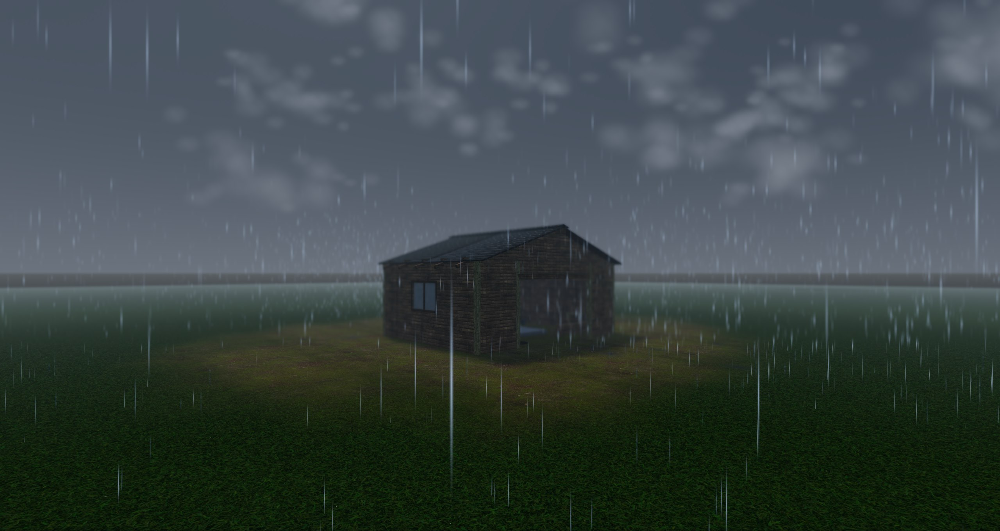
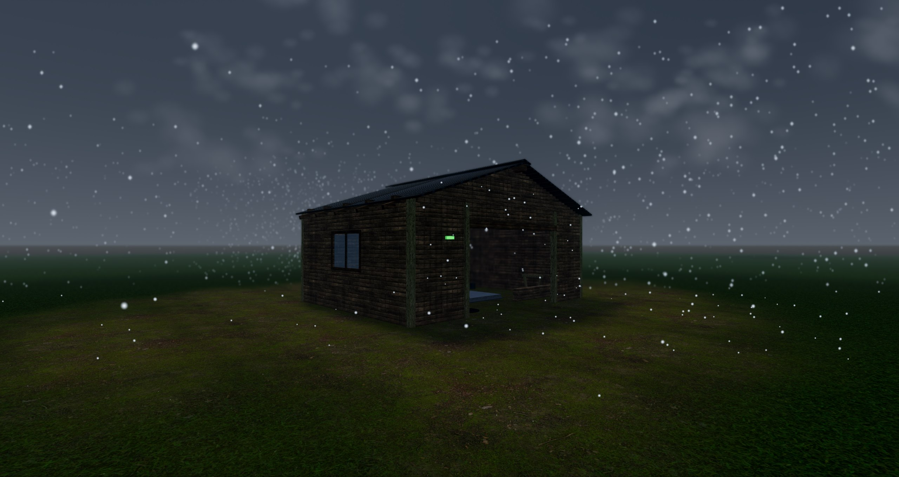
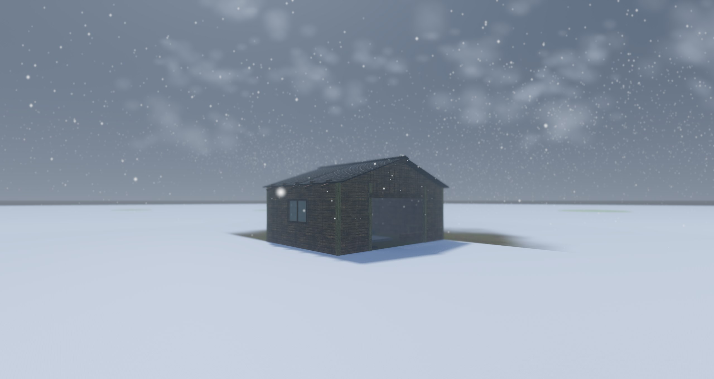

### Гроза

Молния — не линия в пиксель, а лента из двух полос крест-накрест, поэтому
разряд видно с любой стороны. Бьёт в землю, ветвится, иногда разряжается
внутри тучи. Гром догоняет с задержкой по расстоянию: дальний — глухой,
близкий — треском. Молния может ударить в трубу и поджечь сарай; спасает
громоотвод.

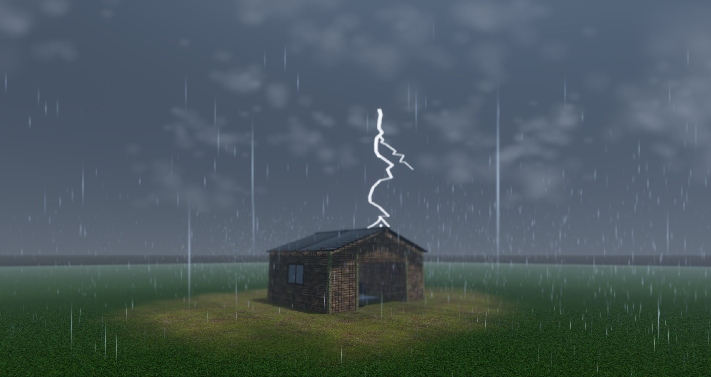
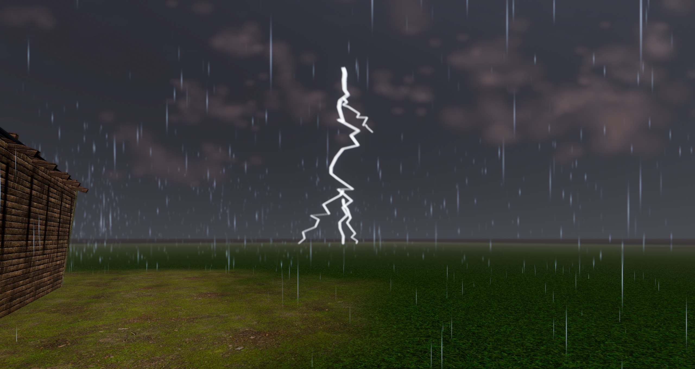

### Радуга и лужи

Радуга двойная: главная дуга и над ней слабая с обратным порядком цветов.
Встаёт всегда напротив солнца и тает у земли в дымке. Дождь наливает лужи,
лужи отражают небо, солнце их сушит.

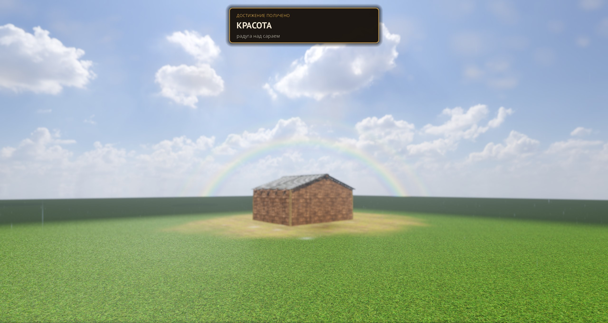

### Туман

Туман утренний, вечерний, морозный и просто погодный, плюс смог от пожара и
от сырых дров. Видимость считается честно: от десяти километров в ясный день
до десяти метров в пургу — и её видно в строке состояния.

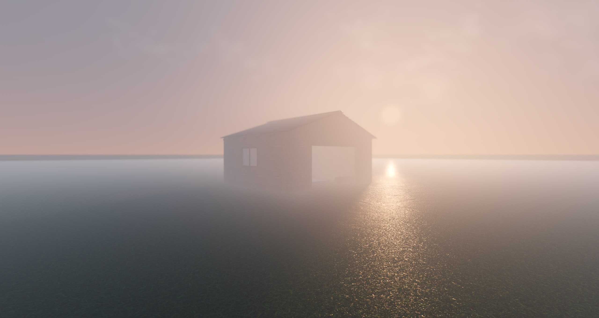
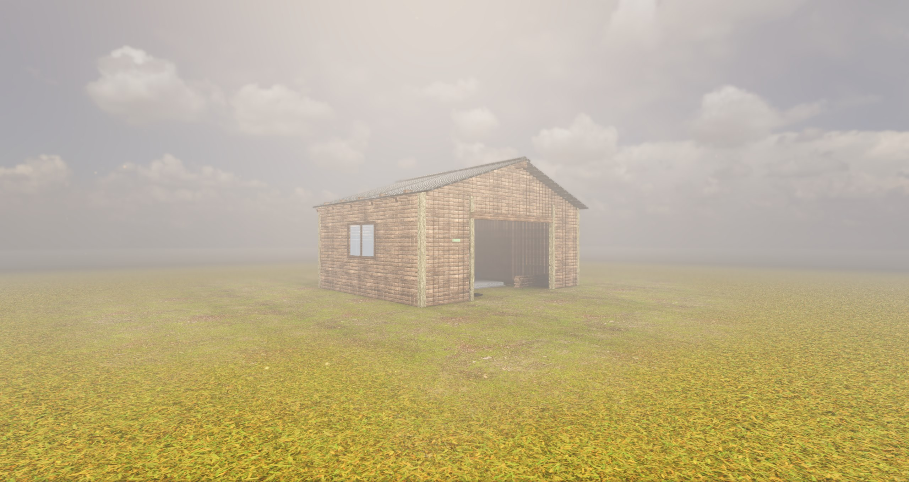
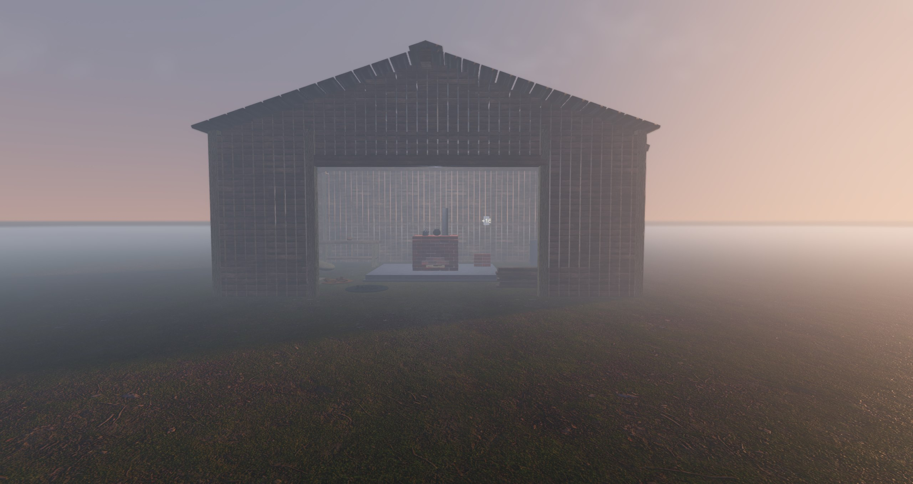

### Ветер

Шкала Бофорта от штиля до урагана, с порывами и сменой направления. Ветер
кладёт дым набок, гонит снег горизонтально, качает траву, носит осенний лист,
гудит в трубе — и меняет тягу: встречный её рубит, попутный поднимает, ураган
задувает дым обратно в сарай.

### Сезоны

Весна, лето, осень и зима — у каждого своя палитра, своя температура и свой
список погод. Град и гроза бывают только летом, пурга — только зимой. Осенью
трава уходит в золото и летит лист, зимой двор и холмы до горизонта стоят в
снегу.

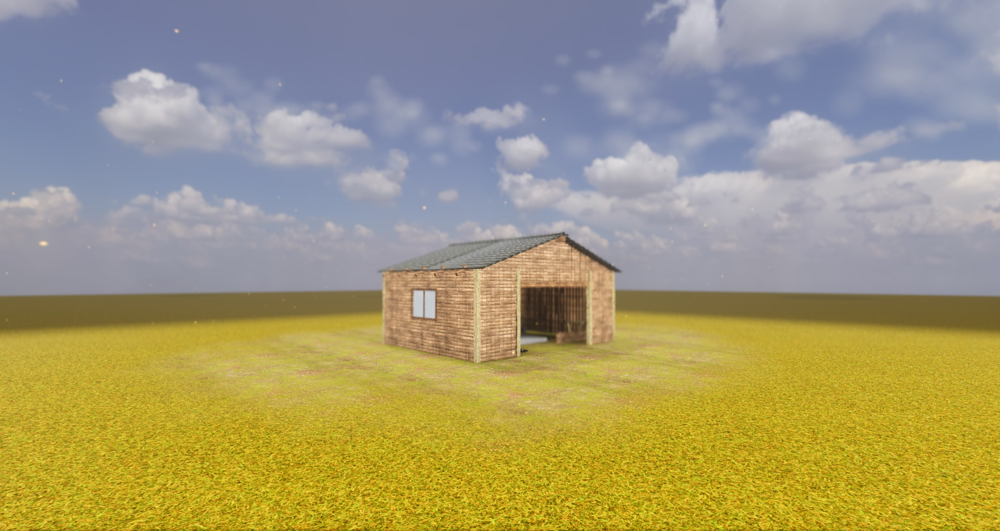

### Звук

Всё синтезируется процедурно, ни одного готового файла: треск огня, гул в
трубе, стук дождя по земле и по крыше, вой ветра в щелях, град, раскаты грома
с эхом, шаги, стук кирпича, шлепок цемента, шипение воды на камне.

### Игрок и погода

Под дождём игрок мокнет и тяжелеет, на морозе дрожит и мёрзнет — камеру
потряхивает, шаг короче, по краям кадра иней или капли. Печка при этом
единственное тёплое место на весь двор.

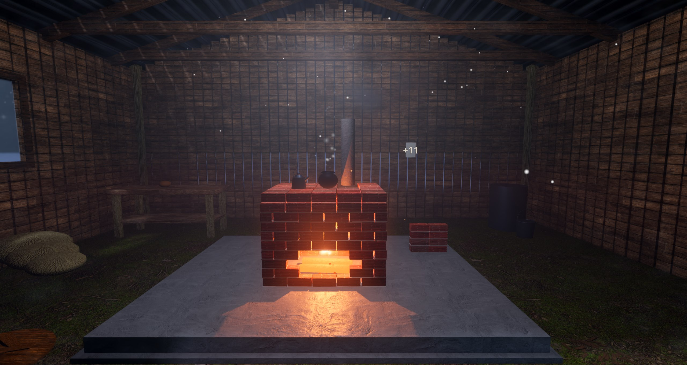
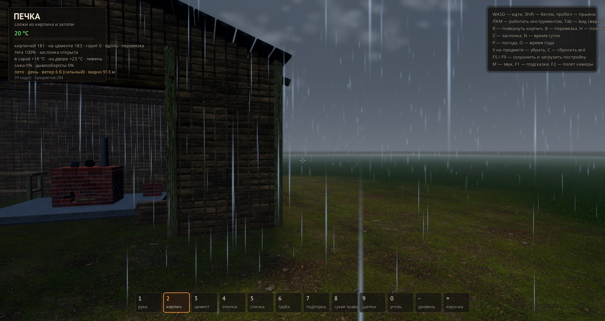
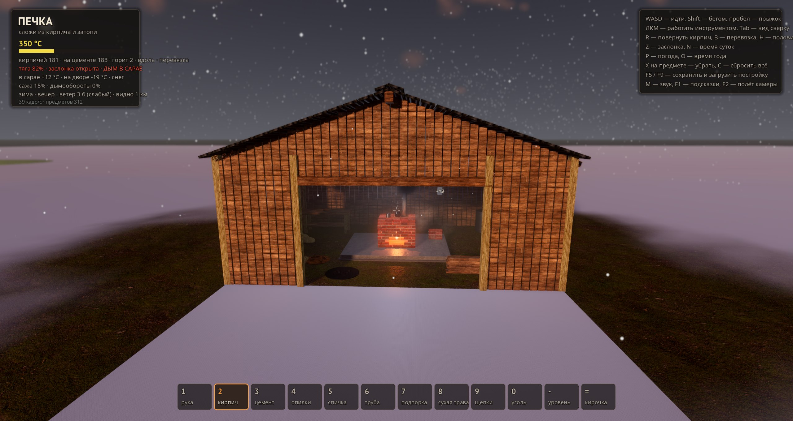

### Достижения

ПЕЧНИК (протопить сарай), КОСМОНАВТ (запустить трубу), КРАСОТА (радуга),
ГРОМООТВОД, МЕТЕОРОЛОГ (пережить ураган), ПОЛЯРНИК (−30 °C), ЗАКАЛЁННЫЙ
(−40 °C), ЛЕТНИЙ (+40 °C), АТМОСФЕРНЫЙ (увидеть всю погоду) — и ПЕКЛО, если
догреть печь до 1000 °C: занимается весь сарай и крышу сдувает. Через пять
секунд сарай приходит в себя и крыша встаёт на место.

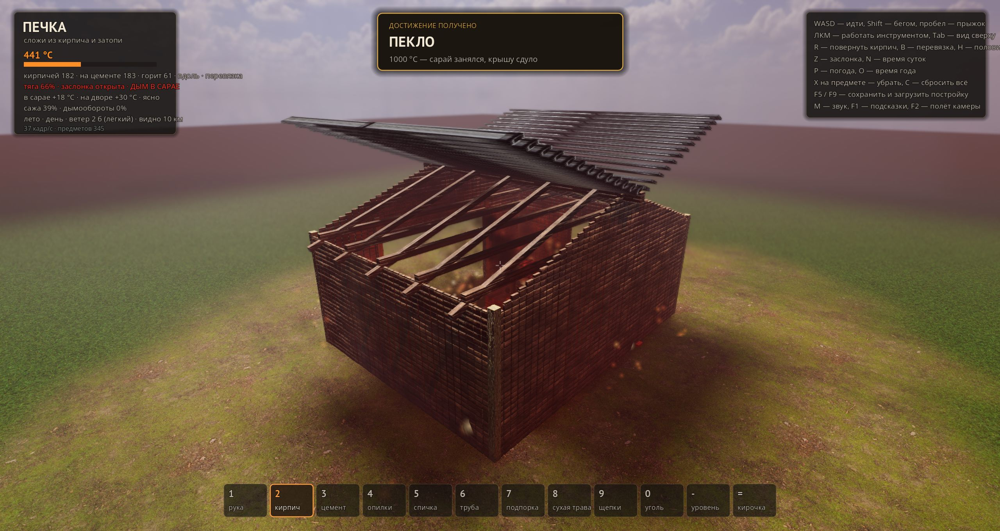

## Кадры в секунду

Самый тяжёлый кадр в игре — гроза над топящейся печью: дождь, объёмный
туман, живой свет от огня и три сотни физических тел одновременно. Замеры на
GeForce RTX 2070 Super, 1920×1080, 260 кадров подряд:

| Качество | Кадров/с | Что внутри |
| --- | --- | --- |
| максимум | 31 | SDFGI, SSIL, объёмный туман 48 м, тени от огня |
| высокое | 60 | SSAO, объёмный туман 28 м, мягкие тени |
| среднее | 60 | туман 22 м, тени попроще |
| низкое | 60 | только прямой свет и тени |

Играют на «высоком» — это режим по умолчанию. «Максимум» честно назван
максимумом: SDFGI пересчитывает отражённый свет от каждого шевелящегося
огонька и стоит дороже всего остального вместе. Он для скриншотов.

Если кадры всё равно просели, игра сама убавит качество через три секунды и
скажет об этом — лезть в настройки не нужно. Вручную переключается на **F3**.

Как дошли до 60: главным едоком оказался не свет и не дождь, а дым. Сотни
полупрозрачных клубов лежат друг на друге, и каждый пиксель считался заново
со всем освещением и тенями. Свет по вершинам вместо попиксельного, отказ от
теней на дыме, параболоидные тени вместо кубических у живых огней и вывод
мерцающего огня из расчёта переотражений — гроза с печью поднялась с 36
кадров до 60.

## Запуск

Готовый exe: `pechka_godot/build/Pechka.exe` (собирается, в репозиторий не
кладётся). Из исходников — Godot 4.7:

```
godot --path pechka_godot
```

Полезные флаги для проверки и съёмки:

```
--sky=N        погода 0…12 (ясно, облачно, морось, дождь, ливень, гроза,
               грибной дождь, снег, метель, пурга, град, ледяной дождь, туман)
--season=N     0 весна, 1 лето, 2 осень, 3 зима
--time=N       0 рассвет, 1 утро, 2 день, 3 вечер, 4 ночь
--bolt         ударить молнией туда, куда смотрит камера
--lit          затопить готовую печь
--boom         сразу 1000 °C и пасхалка
--rocket       показать запуск трубы
--plan         пустой фундамент с чертежом
--plan-part=X  сложить долю печки по чертежу, 0…1
--tutor=N      показать шаг обучения N
--quality=N    0 максимум, 1 высокое, 2 среднее, 3 низкое
--noauto       не подстраивать качество автоматически
--off=a,b      выключить эффекты для замеров: sdfgi, vol, ssil, ssao,
               glow, shadow, fire, smoke, firelight, rain, prox
--eye=x,y,z,yaw,pitch    свободная камера, углы в градусах
--fp=x,y,z,yaw,pitch     кадр от первого лица
--nohud        снять интерфейс
--shot=путь --shot-frames=N   сохранить кадр и выйти
```

## Как устроено

```
pechka_godot/
  main.tscn
  scripts/
    game.gd        игровая логика: кладка, огонь, тепло, угар, сохранения
    weather.gd     погода целиком: небо, осадки, ветер, гроза, туман, сезоны
    world.gd       мир: земля, сарай, свет, окружение, уровни качества
    fire.gd        огонь, дым, искры, пар, угольная пыль
    player.gd      первое лицо, ходьба, мокрый и замёрзший игрок
    tutor.gd       обучение: цепочка шагов и проверки
    hud.gd         интерфейс, подсказки, достижения
    sfx.gd         процедурный звук: всё синтезируется на месте
    piece.gd       кирпич, труба, топливо — физические тела
    cookware.gd    чайник и котелок
    mats.gd        материалы и текстуры
  assets/          PBR-текстуры и шрифты
docs/shots/        скриншоты
```
