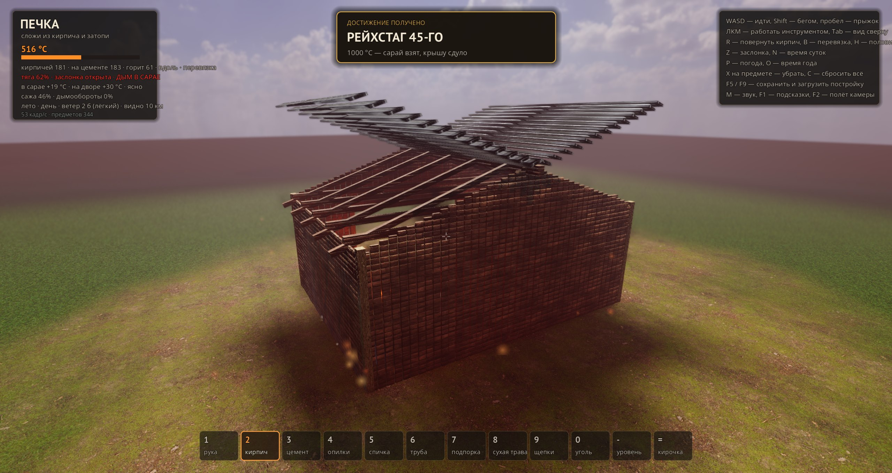

# Печка

Строишь кирпичную печь в сарае, топишь её и греешь сарай. Кладёшь кирпич за
кирпичом, мажешь цементом, тянешь трубу, поджигаешь спичкой — и смотришь, что
из этого выйдет. Игра на Godot 4 (Forward+, Vulkan), всё вокруг настоящая
физика: каждый кирпич, щепка, уголёк и ведро — отдельное тело.


## Про что игра

Печь надо собрать правильно: с перевязкой, на цементе, со сводом над топкой и
с трубой наружу. Собрал криво — кладка треснет от жара и осядет. Забыл трубу —
дым пойдёт в сарай. Закрыл заслонку раньше времени — получишь угар и упадёшь.
Топливо разное: дрова, опилки, щепки, сухая трава, подпорки и уголь. У каждого
своя температура горения, своё пламя и свой дым. Уголь даёт тысячу градусов,
но если пошвырять его в топке — поднимется угольная пыль, а она взрывается.

Цель простая: натопить сарай до +20 °C. Дальше — как пойдёт.

| Клавиша | Что делает |
| --- | --- |
| WASD, Shift, пробел | идти, бегом, прыжок |
| ЛКМ | работать инструментом |
| 1…= | выбрать инструмент |
| R, B, H | повернуть кирпич, перевязка, половинка |
| Z | заслонка |
| N, O, P | время суток, время года, погода |
| Tab, F2 | вид сверху, полёт камеры |
| F5, F9 | сохранить и загрузить постройку |
| X, C | убрать предмет, сбросить всё |

## Погода

Погода — отдельная система на 1300 строк: сезон, время суток, тип погоды,
ветер по Бофорту, облака, осадки, гроза, туман, радуга и лужи считаются в
одном месте, чтобы свет, небо и земля не спорили друг с другом.

### Небо

Пять ярусов облаков — кучевые, перистые, слоистые, кучево-дождевые и грозовые
наковальни. Каждое облако набрано из двух десятков пуховок разного калибра,
поэтому край рваный, а середина плотная. Облака едут по ветру и красятся под
время суток: белые днём, розовые на закате, почти чёрные в грозу.

Ночью — панорама с одиннадцатью тысячами звёзд, млечным путём поперёк неба и
Полярной на севере. Луна с четырьмя фазами, и чем она полнее, тем светлее
двор. Звёзды мерцают.


Рассвет и закат считаются по-своему: у горизонта тёплое рассеивание, вверху
глубокая синь, солнце идёт по дуге и меняет цвет с апельсинового на белый и
обратно на красный.


### Осадки

Тринадцать видов погоды: ясно, облачно, морось, дождь, ливень, гроза, грибной
дождь, снег, метель, пурга, град, ледяной дождь и туман. Капли тонкие и их
двенадцать тысяч; в ливень они идут струями и разбиваются о землю брызгами.
Снег — от пушинки до мокрого хлопка, в метель летит почти горизонтально.
Град — четырёхсантиметровый лёд, который скачет по двору и стучит по крыше.


### Гроза

Молния — не линия в пиксель, а лента из двух полос крест-накрест, поэтому
разряд видно с любой стороны. Бьёт в землю, ветвится, иногда разряжается
внутри тучи. Гром догоняет с задержкой по расстоянию: дальний — глухой,
близкий — треском. Молния может ударить в трубу и поджечь сарай; спасает
громоотвод.


### Радуга и лужи

Радуга двойная: главная дуга и над ней слабая с обратным порядком цветов.
Встаёт всегда напротив солнца и тает у земли в дымке. Дождь наливает лужи,
лужи отражают небо, солнце их сушит.


### Туман

Туман утренний, вечерний, морозный и просто погодный, плюс смог от пожара и
от сырых дров. Видимость считается честно: от десяти километров в ясный день
до десяти метров в пургу — и её видно в строке состояния.


### Ветер

Шкала Бофорта от штиля до урагана, с порывами и сменой направления. Ветер
кладёт дым набок, гонит снег горизонтально, качает траву, носит осенний лист,
гудит в трубе — и меняет тягу: встречный её рубит, попутный поднимает, ураган
задувает дым обратно в сарай.

### Сезоны

Весна, лето, осень и зима — у каждого своя палитра, своя температура и свой
список погод. Град и гроза бывают только летом, пурга — только зимой. Осенью
трава уходит в золото и летит лист, зимой двор и холмы до горизонта стоят в
снегу.


### Звук

Всё синтезируется процедурно, ни одного готового файла: треск огня, гул в
трубе, стук дождя по земле и по крыше, вой ветра в щелях, град, раскаты грома
с эхом, шаги, стук кирпича, шлепок цемента, шипение воды на камне.

### Игрок и погода

Под дождём игрок мокнет и тяжелеет, на морозе дрожит и мёрзнет — камеру
потряхивает, шаг короче, по краям кадра иней или капли. Печка при этом
единственное тёплое место на весь двор.


### Достижения

КРАСОТА (радуга), ГРОМООТВОД, МЕТЕОРОЛОГ (пережить ураган), ПОЛЯРНИК (−30 °C),
ЗАКАЛЁННЫЙ (−40 °C), ЛЕТНИЙ (+40 °C), АТМОСФЕРНЫЙ (увидеть всю погоду) —
и РЕЙХСТАГ 45-ГО, если догреть печь до 1000 °C. Через пять секунд сарай
приходит в себя и крыша встаёт на место.



## Кадры в секунду

Проверено на 1920×1080, три уровня качества (клавиша выбирается флагом
`--quality=0|1|2`):

| Сцена | Качество | Кадров/с |
| --- | --- | --- |
| Метель, топится печь, 312 предметов | среднее | 59 |
| Гроза с молнией, топится печь, 312 предметов | высокое (SDFGI, SSIL, объёмный туман) | 36 |

На среднем качестве SDFGI отключено намеренно: с десятком живых огней он
съедал больше половины кадров.

## Запуск

Готовый exe: `pechka_godot/build/Pechka.exe` (собирается, в репозиторий не
кладётся). Из исходников — Godot 4.7:

```
godot --path pechka_godot
```

Полезные флаги для проверки и съёмки:

```
--sky=N        погода 0…12 (ясно, облачно, морось, дождь, ливень, гроза,
               грибной дождь, снег, метель, пурга, град, ледяной дождь, туман)
--season=N     0 весна, 1 лето, 2 осень, 3 зима
--time=N       0 рассвет, 1 утро, 2 день, 3 вечер, 4 ночь
--bolt         ударить молнией туда, куда смотрит камера
--lit          затопить готовую печь
--boom         сразу 1000 °C и пасхалка
--quality=N    0 высокое, 1 среднее, 2 низкое
--eye=x,y,z,yaw,pitch    свободная камера, углы в градусах
--fp=x,y,z,yaw,pitch     кадр от первого лица
--nohud        снять интерфейс
--shot=путь --shot-frames=N   сохранить кадр и выйти
```

## Как устроено

```
pechka_godot/
  main.tscn
  scripts/
    game.gd        игровая логика: кладка, огонь, тепло, угар, сохранения
    weather.gd     погода целиком: небо, осадки, ветер, гроза, туман, сезоны
    world.gd       мир: земля, сарай, свет, окружение, уровни качества
    fire.gd        огонь, дым, искры, пар, угольная пыль
    player.gd      первое лицо, ходьба, мокрый и замёрзший игрок
    hud.gd         интерфейс, подсказки, достижения
    sfx.gd         процедурный звук: всё синтезируется на месте
    piece.gd       кирпич, труба, топливо — физические тела
    cookware.gd    чайник и котелок
    mats.gd        материалы и текстуры
  assets/          PBR-текстуры и шрифты
docs/shots/        скриншоты
```
